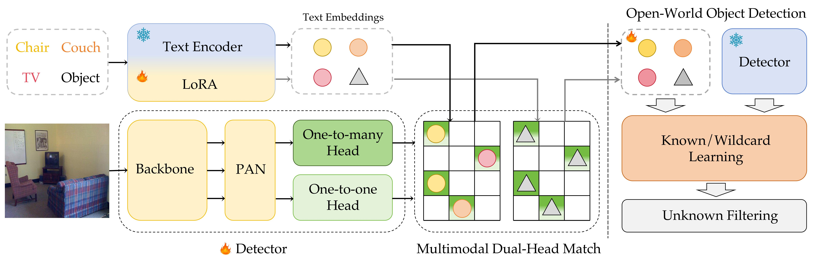

# YOLO-UniOW: Efficient Universal Open-World Object Detection

The official implementation of **YOLO-UniOW** [[`arxiv`](https://arxiv.org/abs/2412.20645)]




## Zero-shot Performance on LVIS Dataset

YOLO-UniOW-S/M/L has been pre-trained from scratch and evaluated on the `LVIS minival`. The pre-trained weights can be downloaded from the link provided below.

|                            Model                             | #Params | AP<sup>mini</su> | AP<sub>r</sub> | AP<sub>c</sub> | AP<sub>f</sub> | FPS (V100) |
| :----------------------------------------------------------: | :-----: | :------------------: | :-------------: | :-------------: | :-------------: | :--------: |
| [YOLO-UniOW-S](https://huggingface.co/leonnil/yolo-uniow/resolve/main/yolo_uniow_s_lora_bn_5e-4_100e_8gpus_obj365v1_goldg_train_lvis_minival.pth) |  7.5M   |         26.2         |      24.1       |      24.9       |      27.7       |    98.3    |
| [YOLO-UniOW-M](https://huggingface.co/leonnil/yolo-uniow/resolve/main/yolo_uniow_m_lora_bn_5e-4_100e_8gpus_obj365v1_goldg_train_lvis_minival.pth) |  16.2M  |         31.8         |      26.0       |      30.5       |       34        |    86.2    |
| [YOLO-UniOW-L](https://huggingface.co/leonnil/yolo-uniow/resolve/main/yolo_uniow_l_lora_bn_5e-4_100e_8gpus_obj365v1_goldg_train_lvis_minival.pth) |  29.4M  |         34.6         |      30.0       |      33.6       |      36.3       |    64.8    |

## Experiment Setup

### Data Preparation

For preparing open-vocabulary and open-world data, please refer to [docs/data](./docs/data.md).

### Installation

Our model is built with **CUDA 11.8** and **PyTorch 2.1.2**. To set up the environment, refer to the [PyTorch official documentation](https://pytorch.org/get-started/locally/) for installation guidance. For detailed instructions on installing `mmcv`, please see [docs/installation](./docs/installation.md).

```bash
conda create -n yolouniow python=3.9
conda activate yolouniow
pip install torch==2.1.2 torchvision==0.16.2 --index-url https://download.pytorch.org/whl/cu118
pip install mmcv==2.1.0 -f https://download.openmmlab.com/mmcv/dist/cu118/torch2.1/index.html
pip install -r requirements.txt
pip install -e .
```

### Training & Evaluation

For open-vocabulary model training and evaluation, please refer to `run_ovod.sh`

```bash
# Train Open-Vocabulary Model
./tools/dist_train.sh configs/pretrain/yolo_uniow_s_lora_bn_5e-4_100e_8gpus_obj365v1_goldg_train_lvis_minival.py 8 --amp

# Evaluate Open-Vocabulary Model
./tools/dist_test.sh configs/pretrain/yolo_uniow_s_lora_bn_5e-4_100e_8gpus_obj365v1_goldg_train_lvis_minival.py \
    pretrained/yolo_uniow_s_lora_bn_5e-4_100e_8gpus_obj365v1_goldg_train_lvis_minival.pth 8
```

For open-world model training and evaluation, please follow the steps provided in `run_owod.sh`. Ensure that the model is trained before proceeding with the evaluation.

```bash
# 1. Extract text/wildcard features from pretrained model
python tools/owod_scripts/extract_text_feats.py --config $CONFIG --ckpt $CHECKPOINT --save_path $EMBEDS_PATH

# 2. Fine-tune wildcard features
./tools/dist_train.sh $OBJ_CONFIG 8 --amp

# 3. Extract fine-tuned wildcard features
python tools/owod_scripts/extract_text_feats.py --config $OBJ_CONFIG --save_path $EMBEDS_PATH --extract_tuned

# 4. Train all owod tasks
python tools/owod_scripts/train_owod_tasks.py MOWODB $OW_CONFIG $CHECKPOINT

# 5. Evaluate all owod tasks
python tools/owod_scripts/test_owod_tasks.py MOWODB $OW_CONFIG --save
```

To train and evaluate on specific datasets and tasks, use the commands below:

```bash
# Train owod task
DATASET=$DATASET TASK=$TASK THRESHOLD=$THRESHOLD SAVE=$SAVE \
./tools/dist_train_owod.sh $CONFIG 8 --amp

# Evaluate owod task
DATASET=$DATASET TASK=$TASK THRESHOLD=$THRESHOLD SAVE=$SAVE \
./tools/dist_test.sh $CONFIG $CHECKPOINT 8
```

## Acknowledgement

This project builds upon [YOLO-World](https://github.com/AILab-CVC/YOLO-World), [YOLOv10](https://github.com/Trami1995/YOLOv10), [FOMO](https://github.com/orrzohar/FOMO), and [OVOW](https://github.com/343gltysprk/ovow/). We sincerely thank the authors for their excellent implementations!
